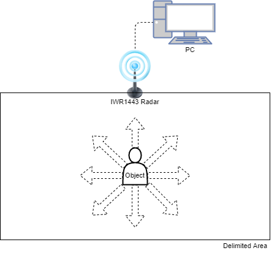
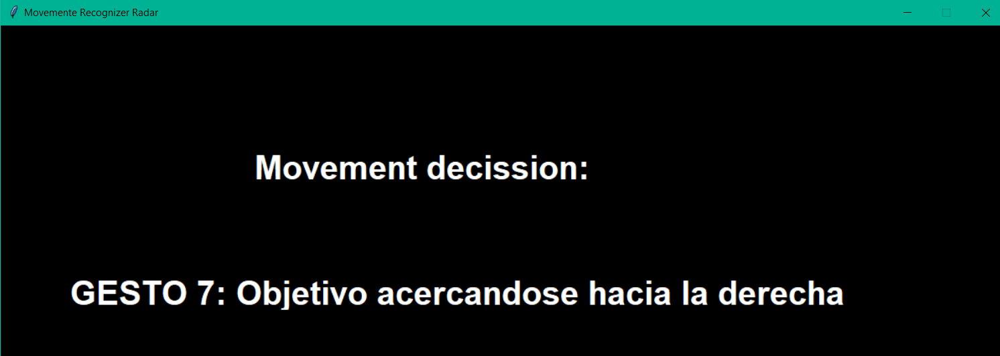
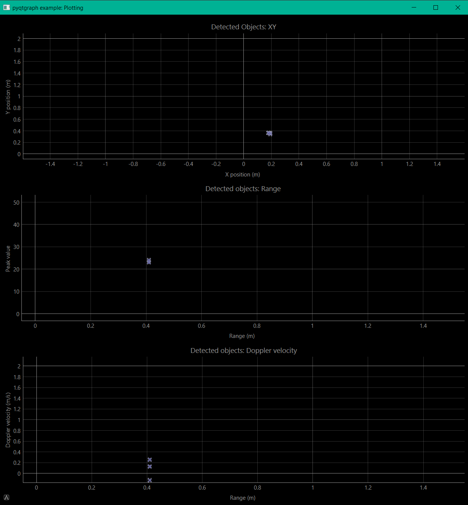

# **IWR1443 Radar Project**

## **Files**

- *data_plotting.py* : This file recognizes and connects to the IWR1443 TI device to read and process its data. It opens a window with three different plots. These plots include *XY*, *Range* and *Doppler Velocity*.

- *distance_sensor.py* : This file recognizes and connects to the IWR1443 TI device to read and process its data. It gets the object´s distance value and prints a message when it is under certain value.

- *movement_recognizer.py* : This file recognizes and connects to the IWR1443 TI device to read and process its data stream. It recognizes several movements from an object within a given delimitated area. Movements include *approaching*, *moving away*, *moving to the right*, *moving to the left*, *aproaching to the right*, *approaching to the left*, *moving away to the left*, *moving away to the right* and *static*. Movement decision appears in a tkinter window as a GUI.

- *movement_recognizer_v2.py* : This file recognizes and connects to the IWR1443 TI device to read and process its data stream. It recognizes several movements from an object within a given delimitated area. Movements include *approaching*, *moving away*, *moving to the right*, *moving to the left*, *aproaching to the right*, *approaching to the left*, *moving away to the left*, *moving away to the right* and *static*. Movement decision appears in a tkinter window as a GUI along with another PyQTgraph window appearing to plot the detected object in a cartesian XY plot.

- *profile.cfg* : This is the configuration file that uploads the predefined parameters to the IWR1443 TI device. These configuration values can be obtained from the [Interface website](https://dev.ti.com/gallery/view/mmwave/mmWave_Demo_Visualizer/ver/2.1.0/) from TI or for further studies consulting TI IWR1443 device documentation. This file is uploaded automatically from the above python files.

- /*images* : folder containing the images used for the readme.md.

## **Python**

### **Version**

> python version used -> 3.10

### **Libraries**

- time
- serial
- numpy
- threading
- statistics
- tkinter
- pyqtgraph

## **Movement recognition**

The image below shows the conceptual scheme for the movement recognition program. This consists in the radar device connected both for the data, via serial port (USB), and the power suply (also USB), to the PC which will be running the program. The shown rectangle is the delimited area in whis the object/user is supposed to be moving. All movements shown by the arrows coming out of the object/user are recognizable in the program plus static or no movement for a total of 9 different movements.

Previous considerations:

- There is only one real object moving inside the area

The movement recognition program is set as follows:

1. Checks if data has been adquired correctly and that there is at least one data value available.
2. Stores both X and Y values and checks that those values for the found objects are within the previously delimited area. If any value is found outside the area they will be discarded.
3. Checks that there are still values stored in the X and Y variables. Mean value of those will be the X and Y values for the decided object in the area.
4. Current XY values are compared to the previous iteration stored values (for the first iteration this previous value is arbitrary). First it will compare the difference between values for X and Y repectively with a predefined value acting as a static (no movement) threshold. If that is not the case it will compare both previous and current iteration for X and Y repectively to make a movement decision. This resulting decision is stored in a list. Also X and Y values are stored in the previous XY values for the following iteration.
5. When the list is at list 10 elements long, the mode is done over it to get the final decision which will be the one that will be both printed in the command line interface and in the Tkinter window GUI.
6. Lastly the X and Y decision lists are emptied before new iteration.

It is worth mentioning that for the second version of the movement recognizer a new thread has been executed in order to be able to run the pyqtgraph XY plot in another window at the same time.

### **Tkinter GUI**

The following is an example image of the tkinter GUI used to display the movement decission:

## **Plotting**

The following is an example image showing how the outputed plots from pyqtgraph look like:

## **Use manual**

In orther to run any of the programs just type in a terminal the file you want to run with python and let the program do the rest:

>python3 data_plotting.py

note that you might have to change some file paths inside the code to run it properly and you can always adjust some variables like for example the delimited area or the detection distance for the distance sensor.

## **References**

Most of the code for reading and parsing the data comming from the IWR1443 device has been taken from [this repository](https://github.com/ibaiGorordo/IWR1443-Read-Data-Python-MMWAVE-SDK-1)
